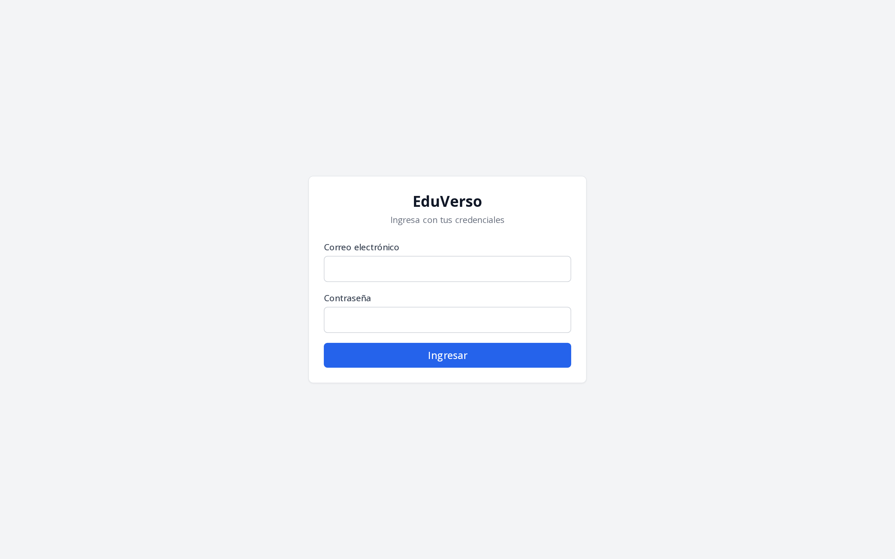
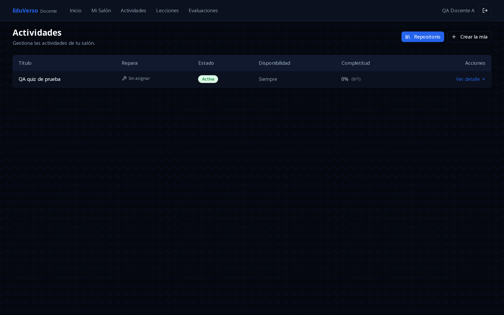
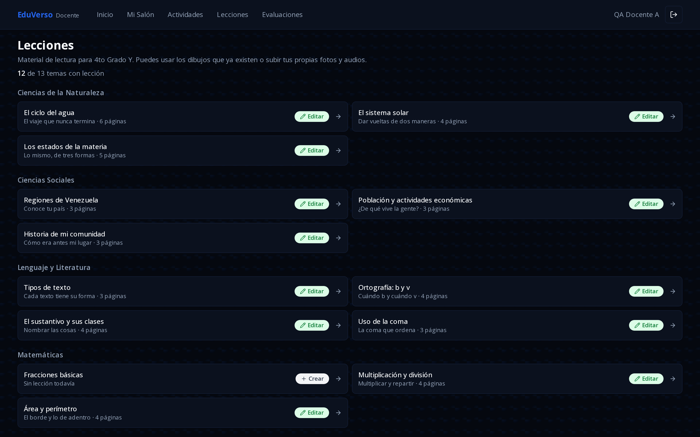
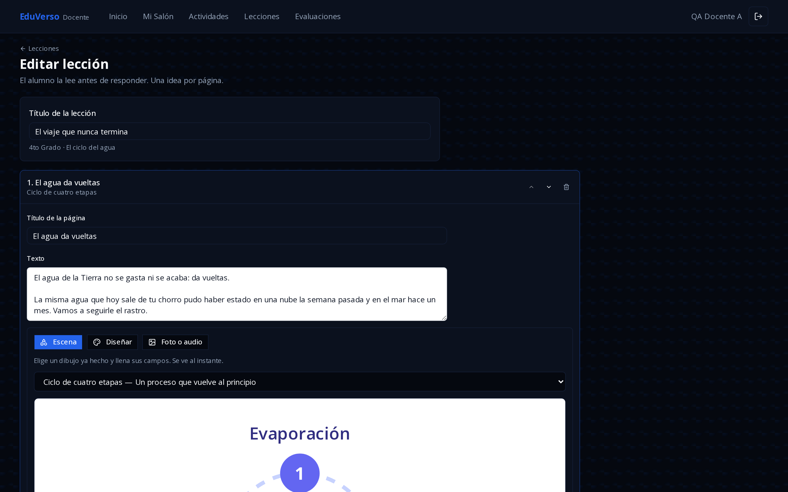
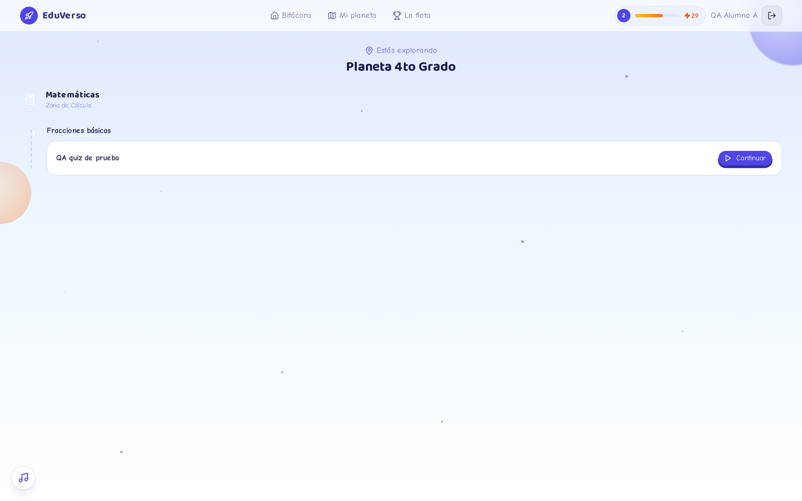

REPÚBLICA BOLIVARIANA DE VENEZUELA
UNIVERSIDAD NACIONAL EXPERIMENTAL DE GUAYANA
VICERRECTORADO ACADÉMICO
COORDINACIÓN GENERAL DE PREGRADO
PROYECTO DE CARRERA INGENIERÍA EN INFORMÁTICA

---

# P R O P O N E N T E S

**NÚMERO DE LA PROPUESTA:** _________________________ *(Registrada en el Sistema de TG, Ejem: TG-2026-YYYY)*

**PROYECTO DE CARRERA:** Ingeniería en Informática  **Sede:** Ciudad Guayana

**Nombre y Apellido del Estudiante:** _________________________  **N° C.I:** _________________

**Nombre y Apellido del Estudiante:** _________________________  **N° C.I:** _________________

**N° Telf:** _________________  **Correo electrónico:** _________________________

# T U T O R   A C A D É M I C O

**Apellido y Nombre:** _________________________  **N° C.I.:** _________________

**Título Universitario:** _________________________  **Estudios de Postgrado:** _________________

**Condición laboral:** _____________  **Categoría:** _____________  **Teléfono:** _____________

**Correo electrónico:** _________________________

---

### SOLO PARA USO DE LA COMISIÓN DE TRABAJO DE GRADO

| | |
|---|---|
| Fecha consignación: ___ / ___ / ______ | Fecha Devuelto para Mejoras: ___ / ___ / ______ |
| Fecha primera revisión: ___ / ___ / ______ | Fecha segunda revisión: ___ / ___ / ______ |

---

# CONTENIDO DE LA PROPUESTA DE TRABAJO DE GRADO

## MODALIDAD DE TRABAJO DE GRADO

Monografía (Documento): ____  Reporte de Investigación: ____  Productos o Artefactos: ____

**Desarrollo de aplicaciones: _X_**  Otras producciones: _________________________

---

## TÍTULO TENTATIVO DE LA PROPUESTA

DESARROLLO DE UNA APLICACIÓN WEB PROGRESIVA CON GAMIFICACIÓN E INTELIGENCIA
ARTIFICIAL PARA LA GESTIÓN ACADÉMICA Y LA ELABORACIÓN DE MATERIAL DE REFUERZO
EN UNA INSTITUCIÓN DE EDUCACIÓN PRIMARIA DE CIUDAD GUAYANA, ESTADO BOLÍVAR.

---

## PROBLEMA OBJETO

La transformación digital de las instituciones educativas ha dejado de ser una
innovación opcional para convertirse en una exigencia estructural. La
Organización de las Naciones Unidas para la Educación, la Ciencia y la Cultura
(Unesco, 2023) señala que la incorporación de tecnologías digitales en los
sistemas escolares de América Latina y el Caribe avanza de forma desigual, y
que su beneficio depende menos de la disponibilidad de equipos que de la
existencia de contenidos pertinentes y de docentes capaces de producirlos. En
el ámbito nacional, la expansión histórica de la matrícula escolar venezolana
ha multiplicado el volumen de información que cada plantel debe administrar,
sin que ese crecimiento haya venido acompañado de herramientas informáticas
proporcionales en los niveles de educación primaria.

En ese contexto, los procesos de enseñanza y de administración en numerosas
escuelas primarias continúan apoyados en registros físicos y en material de
refuerzo elaborado a mano. Desde la perspectiva pedagógica, la literatura
especializada ofrece explicaciones consistentes sobre por qué ese material
resulta poco eficaz. Mayer (2009), en su teoría cognitiva del aprendizaje
multimedia, sostiene que el estudiante construye representaciones más duraderas
cuando la palabra y la imagen se presentan de forma integrada y coordinada, y
que todo elemento ajeno al objetivo de aprendizaje compite por una capacidad de
procesamiento limitada. En la misma línea, Sweller, Ayres y Kalyuga (2011)
advierten que fragmentar el contenido en unidades mínimas reduce la carga
cognitiva extrínseca y libera recursos para la comprensión. Complementariamente,
Kapp (2012) argumenta que las mecánicas de gamificación educativa resultan
determinantes para sostener la motivación intrínseca del estudiante, y
convierten el cumplimiento de asignaciones extraescolares en una práctica
continuada.

La institución objeto de estudio es una escuela de educación primaria ubicada
en Ciudad Guayana, estado Bolívar, cuyo diagnóstico preliminar —realizado
durante el primer trimestre de 2026 mediante observación directa y entrevistas
no estructuradas al personal directivo y docente— permitió identificar tres
deficiencias operativas concretas:

1. **La gestión de datos académicos es enteramente manual.** El control del
   ciclo de vida del estudiante —ingreso, matrícula, promoción y egreso— se
   lleva en registros físicos, lo que impide consultar la información de forma
   inmediata, dificulta la trazabilidad de cada movimiento y expone los
   expedientes a pérdida o deterioro.

2. **El cuerpo docente carece de una plataforma para elaborar y distribuir
   material de refuerzo.** Cada maestro produce sus guías a mano o reutiliza
   fotocopias, sin un repositorio común ni posibilidad de corregir y reeditar
   lo ya elaborado. El material resultante es predominantemente textual, pese a
   que el fundamento teórico expuesto señala la ilustración integrada como
   condición del aprendizaje en estas edades.

3. **La coordinación no dispone de información consolidada del desempeño.** El
   seguimiento del rendimiento estudiantil se realiza por consulta verbal a
   cada docente, lo que impide evaluar de forma cuantitativa el avance de la
   población escolar y detectar oportunamente a los estudiantes rezagados.

A las tres deficiencias anteriores se suma una restricción del entorno que
condiciona cualquier solución: la población escolar accede a Internet
principalmente desde teléfonos inteligentes de gama de entrada y con
conectividad residencial intermitente, lo que descarta las aplicaciones de
escritorio y las aplicaciones móviles nativas por su costo de distribución y
sus requerimientos de almacenamiento.

Investigaciones previas han abordado parcialmente esta problemática. Los
antecedentes consultados documentan sistemas de gestión académica web para
instituciones venezolanas, experiencias de gamificación en educación básica y
aplicaciones de asistentes conversacionales en entornos educativos; sin
embargo, ninguno de ellos integra en una misma plataforma la gestión
administrativa, la producción de material ilustrado por el propio docente y la
asistencia mediante inteligencia artificial bajo restricciones explícitas de
seguridad para menores de edad. Ese vacío constituye el punto de partida de la
presente investigación.

Para atender la situación descrita se propone el desarrollo de **EduVerso**,
una solución concebida bajo la arquitectura de Aplicaciones Web Progresivas
(PWA), que permite instalarse desde el navegador del teléfono sin los costos de
distribución de una aplicación nativa. El sistema integrará los módulos de
gestión administrativa con un entorno de aprendizaje gamificado y un módulo de
elaboración de material ilustrado destinado al cuerpo docente. Incorporará,
además, capacidades de inteligencia artificial generativa mediante Modelos
Extensos de Lenguaje, con técnicas de ingeniería de instrucciones aplicadas a
dos agentes de propósito acotado y separado: un tutor contextual dirigido al
estudiante, restringido a orientar sin entregar respuestas, y un asistente de
diseño dirigido al docente, cuya salida se limita a un catálogo cerrado de
componentes gráficos validado por el sistema antes de aplicarse.

La utilidad esperada de la investigación es doble. En lo operativo, liberar
tiempo del personal directivo y docente hoy consumido en tareas mecánicas de
registro y de elaboración manual de material. En lo pedagógico, dotar al
estudiante de refuerzo extraescolar ilustrado y de retroalimentación inmediata
sobre su desempeño, sin que ello interfiera con sus calificaciones formales.

En virtud de los argumentos expuestos, se formula la siguiente interrogante
principal: **¿Cómo desarrollar una aplicación web progresiva con gamificación e
inteligencia artificial que optimice la gestión académica y la elaboración de
material de refuerzo en una institución de educación primaria de Ciudad
Guayana, estado Bolívar?**

De la interrogante principal se derivan las siguientes:

1. ¿Cuál es la situación actual de los procesos de gestión académica y de
   elaboración de material de refuerzo en la institución objeto de estudio?
2. ¿Cuáles son los requerimientos funcionales y no funcionales que debe
   satisfacer la aplicación para atender las necesidades de los perfiles de
   coordinación, docente y estudiante?
3. ¿Cómo debe ser el diseño de la arquitectura de software, del modelo de datos
   y de las interfaces de usuario de la aplicación propuesta?
4. ¿Cómo construir los módulos de gestión académica, de aprendizaje gamificado,
   de elaboración de material ilustrado y de asistencia por inteligencia
   artificial?
5. ¿Cómo validar el funcionamiento, la seguridad de los datos y la usabilidad
   de la aplicación desarrollada?

---

## OBJETIVOS DE LA INVESTIGACIÓN

### Objetivo General

Desarrollar una aplicación web progresiva con gamificación e inteligencia
artificial para la gestión académica y la elaboración de material de refuerzo
en una institución de educación primaria de Ciudad Guayana, estado Bolívar.

### Objetivos Específicos

1. **Diagnosticar** la situación actual de los procesos de gestión académica y
   de elaboración de material de refuerzo en la institución objeto de estudio.

2. **Determinar** los requerimientos funcionales y no funcionales que debe
   satisfacer la aplicación para atender las necesidades de los perfiles de
   coordinación, docente y estudiante.

3. **Diseñar** la arquitectura de software, el modelo de datos y las interfaces
   de usuario de la aplicación propuesta.

4. **Construir** los módulos de gestión académica, de aprendizaje gamificado,
   de elaboración de material ilustrado y de asistencia por inteligencia
   artificial que conforman la aplicación.

5. **Validar** el funcionamiento, la seguridad de los datos y la usabilidad de
   la aplicación desarrollada mediante la aplicación de pruebas.

---

## JUSTIFICACIÓN

La presente investigación se justifica por la necesidad de atender, con
recursos informáticos apropiados al contexto, tres deficiencias operativas
verificadas en la institución objeto de estudio, así como por la oportunidad de
producir conocimiento aplicado sobre la incorporación de inteligencia
artificial generativa en entornos educativos con población menor de edad.

**Desde el punto de vista práctico**, la sistematización del ciclo de vida
académico elimina la dependencia de registros físicos, reduce el margen de
error en la información y permite consultar de forma inmediata datos que hoy
exigen revisión manual de expedientes. A su vez, el módulo de elaboración de
material ilustrado permite que el docente produzca, corrija y reutilice sus
propias láminas sin conocimientos de diseño gráfico, y que el material quede
disponible para consulta posterior por parte del estudiante.

**Desde el punto de vista teórico**, la investigación operacionaliza en un
producto de software tres cuerpos teóricos del aprendizaje: la teoría cognitiva
del aprendizaje multimedia de Mayer (2009), que sustenta la presentación
integrada de imagen y texto; la teoría de la carga cognitiva de Sweller, Ayres
y Kalyuga (2011), que sustenta la organización del contenido en unidades
mínimas; y la noción de andamiaje derivada de la zona de desarrollo próximo de
Vygotsky (1978), que sustenta el comportamiento del agente tutor, orientado a
guiar al estudiante sin sustituir su razonamiento.

**Desde el punto de vista metodológico**, el trabajo documentará el proceso
completo de análisis, diseño, construcción y validación de una aplicación web
progresiva con asistencia por inteligencia artificial, quedando disponible como
antecedente para futuros Trabajos de Grado de la Universidad Nacional
Experimental de Guayana u otras instituciones que aborden temáticas afines.
Particular interés metodológico reviste el procedimiento de validación de la
seguridad a nivel de datos, ejecutado directamente contra las políticas del
motor de base de datos y no únicamente contra la interfaz de usuario.

**Desde el punto de vista académico**, el desarrollo aplica y consolida
conocimientos adquiridos a lo largo del Proyecto de Carrera en las áreas de
ingeniería de software, bases de datos, desarrollo web, seguridad informática e
inteligencia artificial, integrándolos en un producto de complejidad
equiparable a un desarrollo profesional.

**Desde el punto de vista social**, el sistema amplía el acceso al refuerzo
académico extraescolar de una población que, en su mayoría, dispone únicamente
de teléfonos inteligentes de gama de entrada. Al operar como refuerzo formativo
y no punitivo, se asegura que las intermitencias en el acceso tecnológico —
frecuentes en el contexto residencial de la población estudiantil— no
repercutan en las calificaciones formales del estudiante.

### Relevancia científica

La aplicación de Modelos Extensos de Lenguaje en contextos de educación
primaria plantea un problema no resuelto de manera suficiente en la literatura
consultada: cómo acotar la salida del modelo para que resulte segura y
pedagógicamente pertinente con población menor de edad. La presente propuesta
aborda ese vacío mediante dos mecanismos diferenciados: el sembrado de contexto
con instrucciones fijas en el agente dirigido al estudiante, y la validación de
la salida contra un vocabulario cerrado en el agente dirigido al docente, de
modo que toda respuesta no reconocida se descarte antes de llegar al usuario.

### Relevancia social

La investigación atiende una necesidad concreta de una institución educativa
pública que carece de recursos para adquirir software de gestión comercial, y
propone una solución cuyo costo de operación es nulo o marginal, lo que
determina su sostenibilidad una vez concluido el Trabajo de Grado.

### Factibilidad

**Técnica.** Las tecnologías seleccionadas son de uso libre y cuentan con
documentación y comunidad consolidadas. El proponente domina el entorno de
desarrollo requerido.

**Económica.** La infraestructura se apoya en servicios de alojamiento en la
nube bajo esquemas de capa gratuita, lo que suprime la inversión en servidores
por parte del plantel. Los equipos de desarrollo son propiedad del proponente.

**Operativa.** La solución se distribuye como aplicación web progresiva
instalable desde el navegador, sin requerir tiendas de aplicaciones ni
instalaciones asistidas, lo que la hace viable para usuarios sin formación
informática previa.

**Temporal.** El alcance definido se corresponde con un lapso de doce semanas
de ejecución, distribuidas conforme al cronograma de actividades.

---

## ALCANCE Y DELIMITACIÓN

### Delimitación espacial

La investigación se circunscribe a una institución de educación primaria
ubicada en Ciudad Guayana, estado Bolívar, y a su población de estudiantes,
cuerpo docente y personal de coordinación.

### Delimitación temporal

La ingeniería, construcción y validación del producto de software se ejecutarán
en un lapso de doce semanas, comprendido dentro del período académico
correspondiente.

### Delimitación de contenido

El producto final comprenderá tres entornos de usuario, protegidos mediante
políticas de seguridad a nivel de filas en el motor de base de datos, a fin de
garantizar la privacidad de los datos de los menores:

**Entorno de coordinación.** Gestión centralizada del ciclo de vida académico
del estudiante, administración del personal docente, y creación y activación de
años escolares. La promoción individual de cada estudiante se registra por
decisión de su docente.

**Entorno docente.** Consulta de información agregada de desempeño de su
salón, registro de evaluaciones presenciales, asignación de actividades
digitales a partir de plantillas pedagógicas, y elaboración del material de
refuerzo ilustrado correspondiente a los temas de su grado, mediante un editor
visual que opera sobre un catálogo cerrado de componentes gráficos y admite,
como alternativa, la incorporación de imágenes o audio propios.

**Entorno del estudiante.** Lectura del material ilustrado de cada tema,
resolución de actividades gamificadas con registro de puntos de experiencia,
progresión por niveles y tablas de clasificación, y acceso al agente tutor bajo
un límite de consultas contabilizado por cada paso de la actividad.

### Limitaciones

Quedan excluidos del alcance de este Trabajo de Grado:

1. El desarrollo de clientes nativos independientes para los ecosistemas iOS y
   de escritorio, por considerarse suficiente la compatibilidad que brinda el
   estándar de Aplicaciones Web Progresivas.
2. La vinculación del sistema con el registro de calificaciones formales ante
   el Ministerio del Poder Popular para la Educación, preservándose la
   naturaleza de refuerzo no punitivo de la plataforma.
3. Los módulos de mensajería sincrónica entre usuarios.
4. La modificación, por parte de docentes o estudiantes, de las reglas de
   comportamiento del agente tutor, de su tope de consultas o de su restricción
   de no entregar respuestas directas. El asistente de diseño dirigido al
   docente, por su parte, no genera texto pedagógico ni evalúa al estudiante:
   su salida se limita a la disposición de componentes de un catálogo cerrado,
   y es validada por el sistema antes de aplicarse. La redacción del material
   de refuerzo permanece bajo la autoría y responsabilidad del docente.

---

## MARCO TEÓRICO/REFERENCIAL O CONCEPTUAL

### Antecedentes de la investigación

*Nota para el proponente: completar cada ficha con los datos de tres trabajos
de grado o artículos arbitrados consultados, preferentemente de los últimos
cinco años. Se sugiere incluir al menos uno de la propia UNEG. Estructura de
cada ficha: autor, año, título, institución, objetivo, metodología, resultados
y aporte a la presente investigación.*

**Antecedente 1.** Sistema de gestión académica web para institución educativa
venezolana. *(Aporte esperado: modelo de datos del ciclo de vida del estudiante
y esquema de roles de usuario.)*

**Antecedente 2.** Aplicación de mecánicas de gamificación en educación básica.
*(Aporte esperado: evidencia sobre el efecto de los sistemas de puntos y
niveles en la participación estudiantil.)*

**Antecedente 3.** Incorporación de asistentes conversacionales basados en
Modelos Extensos de Lenguaje en entornos educativos. *(Aporte esperado:
técnicas de acotamiento de la salida del modelo y consideraciones éticas con
población menor de edad.)*

### Bases teóricas

**Aplicaciones Web Progresivas (PWA).** Modelo de desarrollo que permite a una
aplicación web instalarse en el dispositivo, presentar un icono propio y operar
con capacidades de almacenamiento local, sin requerir distribución por tiendas
de aplicaciones. Se sustenta en tres elementos: el manifiesto de la aplicación,
el trabajador de servicio (*service worker*) y la entrega por conexión segura.

**Gamificación educativa.** Kapp (2012) la define como el uso de mecánicas,
estética y pensamiento de juego para motivar la acción y promover el
aprendizaje. En la presente propuesta se concreta en puntos de experiencia,
progresión por niveles y tablas de clasificación.

**Teoría cognitiva del aprendizaje multimedia.** Mayer (2009) establece que el
aprendizaje es más efectivo cuando la información verbal y la visual se
presentan de forma integrada, y formula, entre otros, los principios de
coherencia, señalización y contigüidad espacial, aplicados en el diseño del
material de refuerzo de este sistema.

**Teoría de la carga cognitiva.** Sweller, Ayres y Kalyuga (2011) distinguen
entre carga intrínseca, extrínseca y pertinente, y sostienen que la reducción
de la carga extrínseca mediante la segmentación del contenido libera recursos
cognitivos para la comprensión. Fundamenta la organización del material en una
idea por página.

**Zona de desarrollo próximo y andamiaje.** Vygotsky (1978) define la zona de
desarrollo próximo como la distancia entre lo que el estudiante logra por sí
mismo y lo que logra con asistencia. El andamiaje consiste en brindar esa
asistencia de forma graduada y retirarla conforme el estudiante gana autonomía.
Fundamenta el comportamiento del agente tutor.

**Modelos Extensos de Lenguaje e ingeniería de instrucciones.** Sistemas de
inteligencia artificial generativa entrenados sobre grandes volúmenes de texto,
cuyo comportamiento se condiciona mediante instrucciones y contexto. La
ingeniería de instrucciones comprende las técnicas para acotar dicho
comportamiento, relevantes aquí para impedir que el agente entregue respuestas
directas o se desvíe del tema.

**Seguridad a nivel de filas (*Row-Level Security*).** Mecanismo del motor de
base de datos que restringe, mediante políticas declarativas, las filas que
cada usuario autenticado puede leer o modificar. A diferencia de la validación
en la capa de aplicación, opera aunque la consulta no provenga de la interfaz
del sistema.

### Bases legales

**Constitución de la República Bolivariana de Venezuela (1999).** Los artículos
102 y 103 consagran la educación como derecho humano y deber social
fundamental, y establecen el derecho de toda persona a una educación integral
de calidad, lo que fundamenta la pertinencia social de toda iniciativa
orientada a mejorar los procesos educativos.

**Ley Orgánica para la Protección de Niños, Niñas y Adolescentes (LOPNNA).** El
artículo 65 consagra el derecho al honor, reputación, propia imagen, vida
privada e intimidad familiar de niños, niñas y adolescentes. Esta disposición
fundamenta directamente las medidas de protección de datos implementadas en el
sistema, en particular el aislamiento de la información personal entre
estudiantes y la restricción de su acceso al personal autorizado.

**Ley Orgánica de Educación (2009).** Establece los principios rectores del
sistema educativo venezolano y el carácter público de la educación, marco en el
que se inscribe el uso de herramientas tecnológicas de apoyo al proceso
formativo.

**Ley de Infogobierno (2013).** Promueve el uso de tecnologías de información
libres y estándares abiertos en el Estado venezolano, criterio atendido por la
presente propuesta mediante la selección de tecnologías de código abierto.

**Ley Especial contra los Delitos Informáticos (2001).** Tipifica los delitos
contra sistemas que utilicen tecnologías de información, incluido el acceso
indebido a datos, lo que refuerza la obligación de implementar los controles de
acceso descritos en la presente propuesta.

*Nota para el proponente: verificar la vigencia y numeración de los artículos
citados en la edición oficial de cada instrumento antes de la consignación
definitiva.*

### Glosario de términos

**Agente tutor:** componente de inteligencia artificial que asiste al
estudiante durante la resolución de una actividad, sin entregar la respuesta.

**Aplicación Web Progresiva (PWA):** aplicación web instalable en el
dispositivo del usuario, que ofrece una experiencia similar a la de una
aplicación nativa sin requerir distribución por tiendas.

**Gamificación:** aplicación de elementos propios del juego en contextos
ajenos al juego, con el fin de motivar la participación.

**Ingeniería de instrucciones (*prompt engineering*):** conjunto de técnicas
para formular las instrucciones que condicionan la respuesta de un modelo de
lenguaje.

**Modelo Extenso de Lenguaje (LLM):** modelo de inteligencia artificial
generativa capaz de producir texto a partir de una instrucción.

**Puntos de experiencia (XP):** unidad de medida del avance del estudiante
dentro del entorno gamificado.

**Seguridad a nivel de filas (RLS):** política declarativa del motor de base de
datos que determina qué filas puede ver o modificar cada usuario.

**Trabajador de servicio (*service worker*):** componente que se ejecuta en
segundo plano en el navegador y habilita el almacenamiento local y la
instalación de una aplicación web progresiva.

---

## METODOLOGÍA

### Tipo de investigación

La presente investigación es de tipo **aplicada**, por cuanto se orienta a la
resolución de un problema concreto y verificado en una institución determinada,
mediante la construcción de un producto de software. Su **nivel es
descriptivo**, ya que caracteriza la situación actual de los procesos objeto de
estudio antes de intervenir sobre ellos.

Se inscribe en la modalidad de **Proyecto Factible**, definida por el Manual de
Trabajos de Grado de la Universidad Pedagógica Experimental Libertador (UPEL,
2016) como la elaboración de una propuesta viable destinada a atender
necesidades de una organización o grupo social, sustentada en una base teórica
y en un diagnóstico previo.

### Diseño de la investigación

El diseño es **de campo y no experimental**. De campo, porque los datos del
diagnóstico se recolectan directamente de la realidad donde ocurren los hechos,
mediante observación y entrevistas al personal de la institución. No
experimental, porque no se manipulan deliberadamente las variables: se observan
los procesos en su contexto natural para luego proponer la solución
informática.

### Población y muestra

**Población.** La población está constituida por el personal directivo,
el cuerpo docente y los estudiantes de la institución de educación primaria
objeto de estudio.

*Nota para el proponente: sustituir por las cifras reales del plantel
(N.º de estudiantes, N.º de docentes, N.º de personal de coordinación).*

**Muestra.** Dado que el personal directivo y docente constituye un grupo
reducido y accesible en su totalidad, se trabajará con la **totalidad de la
población** de ambos estratos, configurándose un **censo poblacional**. Para el
estrato estudiantil, la validación de usabilidad se aplicará mediante un
**muestreo intencional** a los estudiantes de los grados atendidos por los
docentes participantes, por tratarse de los usuarios directos del entorno de
aprendizaje.

### Técnicas e instrumentos de recolección de datos

| Técnica | Instrumento | Objetivo que atiende |
|---|---|---|
| Observación directa | Guía de observación | 1 |
| Entrevista no estructurada | Guion de entrevista | 1 |
| Entrevista estructurada | Cuestionario de requerimientos | 2 |
| Revisión documental | Matriz de registro documental | 1 y 2 |
| Encuesta | Cuestionario de usabilidad | 5 |

### Metodología de desarrollo del sistema

Se adoptará la **Programación Extrema (XP)**, propuesta por Beck (2004), por su
correspondencia con las condiciones reales de ejecución del presente Trabajo de
Grado: equipo de desarrollo reducido, requerimientos susceptibles de ajuste
conforme avanza el diagnóstico, y necesidad de entregas funcionales frecuentes
que permitan retroalimentación temprana del personal de la institución.

De las prácticas que componen la metodología se aplicarán, en particular:

- **Entregas pequeñas y frecuentes.** Incrementos funcionales al término de
  cada ciclo semanal, verificables por el usuario.
- **Diseño simple.** Se construye la solución más sencilla que satisfaga el
  requerimiento vigente, evitando anticipar necesidades no confirmadas.
- **Pruebas continuas.** Construcción de una batería de pruebas automatizadas
  que se ejecuta ante cada modificación, y que constituye la red de seguridad
  que permite refactorizar sin introducir regresiones.
- **Refactorización.** Mejora continua de la estructura interna del código sin
  alterar su comportamiento externo.
- **Cliente disponible.** Consulta periódica al personal directivo y docente
  para validar los incrementos entregados.

### Procedimiento metodológico

**Fase I — Diagnóstico** *(atiende el objetivo específico 1).*
Aplicación de la guía de observación y del guion de entrevista al personal
directivo y docente; revisión de los registros físicos existentes;
caracterización de los procesos actuales de gestión académica y de elaboración
de material de refuerzo, y descripción de las condiciones de acceso tecnológico
de la población estudiantil.

**Fase II — Determinación de requerimientos** *(atiende el objetivo específico 2).*
Aplicación del cuestionario de requerimientos; especificación de requerimientos
funcionales por perfil de usuario y de requerimientos no funcionales de
seguridad, rendimiento y usabilidad; elaboración de los casos de uso y
validación de la especificación con el personal de la institución.

**Fase III — Diseño** *(atiende el objetivo específico 3).*
Definición de la arquitectura de software; diseño del modelo de datos
relacional y de las políticas de seguridad a nivel de filas; elaboración del
diseño de interfaces para los tres perfiles de usuario, y definición de la
estrategia de despliegue.

**Fase IV — Construcción** *(atiende el objetivo específico 4).*
Desarrollo iterativo de los módulos de gestión académica, aprendizaje
gamificado, elaboración de material ilustrado y asistencia por inteligencia
artificial, con entregas funcionales al término de cada ciclo y elaboración
simultánea de las pruebas automatizadas correspondientes.

**Fase V — Validación** *(atiende el objetivo específico 5).*
Ejecución de pruebas de integración sobre los flujos completos de cada perfil;
pruebas de seguridad a nivel de datos, aplicadas directamente contra las
políticas del motor de base de datos con las credenciales de cada rol, a fin de
verificar el aislamiento de la información; verificación de la instalabilidad
de la aplicación web progresiva en dispositivos Android; y aplicación del
cuestionario de usabilidad a los usuarios finales.

### Cronograma de actividades

| Fase | Actividad | Semanas |
|---|---|---|
| I | Diagnóstico de la situación actual | 1 – 2 |
| II | Determinación de requerimientos | 2 – 3 |
| III | Diseño de arquitectura, datos e interfaces | 3 – 4 |
| IV | Construcción de los módulos del sistema | 4 – 10 |
| V | Validación mediante pruebas y ajustes | 10 – 11 |
| — | Redacción del informe final y defensa | 12 |

---

## REFERENCIAS

Arias, F. (2012). *El Proyecto de Investigación. Introducción a la metodología
científica* (6.ª ed.). Caracas: Editorial Episteme. Recuperado de
https://abacoenred.com/wp-content/uploads/2019/02/El-proyecto-de-investigaci%C3%B3n-F.G.-Arias-2012-pdf-1.pdf

Asamblea Nacional de la República Bolivariana de Venezuela. (1999).
*Constitución de la República Bolivariana de Venezuela*. Gaceta Oficial
N.º 36.860.

Asamblea Nacional de la República Bolivariana de Venezuela. (2001). *Ley
Especial contra los Delitos Informáticos*. Gaceta Oficial N.º 37.313.

Asamblea Nacional de la República Bolivariana de Venezuela. (2009). *Ley
Orgánica de Educación*. Gaceta Oficial Extraordinaria N.º 5.929.

Asamblea Nacional de la República Bolivariana de Venezuela. (2013). *Ley de
Infogobierno*. Gaceta Oficial N.º 40.274.

Asamblea Nacional de la República Bolivariana de Venezuela. (2015). *Ley
Orgánica para la Protección de Niños, Niñas y Adolescentes*. Gaceta Oficial
Extraordinaria N.º 6.185.

Beck, K. (2004). *Extreme Programming Explained: Embrace Change* (2.ª ed.).
Boston: Addison-Wesley.

Hurtado de Barrera, J. (2010). *Metodología de la investigación: guía para la
comprensión holística de la ciencia* (4.ª ed.). Caracas: Ediciones Quirón.

Kapp, K. (2012). *The Gamification of Learning and Instruction: Game-based
Methods and Strategies for Training and Education*. San Francisco: Pfeiffer.

Mayer, R. (2009). *Multimedia Learning* (2.ª ed.). Cambridge: Cambridge
University Press.

Sweller, J., Ayres, P., y Kalyuga, S. (2011). *Cognitive Load Theory*. Nueva
York: Springer.

Universidad Pedagógica Experimental Libertador. (2016). *Manual de Trabajos de
Grado de Especialización y Maestría y Tesis Doctorales* (5.ª ed.). Caracas:
FEDUPEL.

Unesco. (2023). *Informe de seguimiento de la educación en el mundo 2023:
tecnología en la educación*. París: Unesco.

Vygotsky, L. (1978). *Mind in Society: The Development of Higher Psychological
Processes*. Cambridge: Harvard University Press.

---

 

| | |
|---|---|
| P R O P O N E N T E S | T U T O R   A C A D É M I C O |
|   _______________________ |   _______________________ |
| FIRMA EN RECONOCIMIENTO DE LA PROPUESTA | FIRMA EN RECONOCIMIENTO DE LA TUTORÍA |

---

# ANEXO A. PANTALLAS DEL PROTOTIPO FUNCIONAL

Las imágenes que siguen fueron capturadas directamente de la aplicación en
ejecución y constituyen el respaldo empírico de la factibilidad técnica
declarada en la sección de Justificación. No corresponden a bocetos ni a
maquetas de diseño: cada pantalla proviene de una sesión real del sistema,
con autenticación resuelta, datos persistidos en la base de datos y las
políticas de seguridad a nivel de filas activas.

Los datos visibles pertenecen a cuentas de prueba creadas expresamente para la
verificación del sistema. Esta decisión no es accesoria: la Ley Orgánica para
la Protección de Niños, Niñas y Adolescentes, invocada en las bases legales de
esta propuesta, protege la imagen y la intimidad de los estudiantes, de modo
que ningún nombre ni dato de un menor real aparece en este documento.

## A.1. Acceso al sistema

## A.2. Módulo del docente

Las pantallas de esta sección corresponden al objetivo específico 4, en lo
relativo a los módulos de gestión académica y de elaboración de material
ilustrado.

![Editor gráfico de escenas, componente central del módulo de elaboración de material de refuerzo. Integra un catálogo de ciento treinta y una piezas ilustradas agrupadas en catorce categorías, herramientas de trazo libre, texto y flechas, fondos predefinidos y un asistente de inteligencia artificial que dispone los elementos a partir de una instrucción en lenguaje natural. La salida del asistente se limita a componentes del catálogo y es validada por el sistema antes de aplicarse; la autoría del material permanece en el docente.](capturas/07-docente-lienzo.png)

## A.3. Módulo del estudiante

Las pantallas de esta sección corresponden al objetivo específico 4, en lo
relativo al módulo de aprendizaje gamificado.

